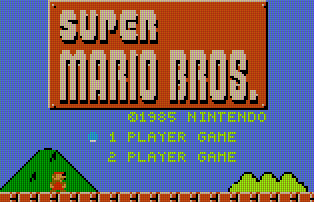

# Super Mario Bros. — Atari Lynx Port

A port of the NES *Super Mario Bros.* to the **Atari Lynx** handheld.

Rather than rewriting the game, this project runs the original 6502 game logic
(from a complete NES disassembly) on the Lynx's 65C02 and wraps every NES
hardware access — graphics, audio, input — in a thin **Lynx adapter layer**. The
NES's tile-based PPU is translated to the Lynx's sprite-based *Suzy* engine, the
NES APU to the Lynx *Mikey* audio channels, and the NES controller to the Lynx
joypad.

All artwork and level data is extracted directly from the original NES ROM
during the build. No copyrighted assets are stored in this repository.



---

## How it works

| NES | Lynx | Translation |
|-----|------|-------------|
| Tile-based PPU, 256×240 | Sprite-based Suzy engine, 160×102 @ 4bpp | Tiles → pre-composited metatile sprites, NES→Lynx palette dedup into ≤16 slots |
| APU, 5 channels | Mikey, 4 channels | Per-frame register translation, software envelope emulation |
| Controller | Joypad + buttons | Input shim |
| 2 KB RAM + separate VRAM | 64 KB unified RAM | NES I/O register equates redirected into RAM |

* `lynx_port/smb_lynx.s` — the NES disassembly converted to `ca65` syntax (~16K lines).
* `lynx_port/lynx_startup.s` — Lynx hardware init and the IRQ→NMI bridge that
  drives the original game loop.
* `lynx_port/lynx_sprites.s` — Suzy sprite rendering and NES→Lynx palette translation.
* `lynx_port/lynx_audio.s` — NES APU → Mikey audio translation.

The graphics scale factor is NES 8×8 → Lynx 5×5 (160×102 fits a 32-column field
exactly).

---

## Prerequisites

* **[cc65](https://cc65.github.io/)** — provides `ca65`, `ld65`, and `sp65`,
  plus the Lynx target library (`lynx.lib`). 
  Don't use you package manager, compile from source:
  ```bash
  git clone https://github.com/cc65/cc65.git
  # The exact commit this port is tested against (see Dockerfile CC65_COMMIT):
  cd cc65 && git checkout c720c3c4854cf36befbb7d1b19fdb207f7549882
  make -j"$(nproc)" && sudo make install PREFIX=/usr/local
  ```
* **Python 3** with **[Pillow](https://pypi.org/project/Pillow/)** — the only
  third-party Python dependency, used by the asset-extraction scripts. Install
  it with `pip install -r requirements.txt`.
* **make** and **bash**.
* An Atari Lynx emulator to run the result (e.g.
  [GearLynx](https://github.com/drhelius/Gearlynx),
  [Felix](https://github.com/laoo/Felix), or
  [Handy](https://atarilynxdeveloper.wordpress.com/)).

Make sure `ca65`, `ld65`, and `sp65` are on your `PATH`. If cc65 is installed
somewhere non-standard, override the tool paths:

```bash
make CA65=/opt/cc65/bin/ca65 LD65=/opt/cc65/bin/ld65 SP65=/opt/cc65/bin/sp65
```


---
## Docker Building (easy)

  ```bash
  git clone https://github.com/pwsqrd/lynx_smb
  cd lynx_smb

  # Drop your ROM in rom/ (any filename, matched by checksum)
  cp /path/to/your/smb.nes rom/

  # Build the image (one-time, ~5 min — compiles cc65 from source)
  docker build -t lynx_smb_builder .

  # Run the build, get the .lnx out
  docker run --rm \
    -v "$PWD/rom:/build/rom" \
    -v "$PWD/out:/build/out" \
    lynx_smb_builder
  ```


---

## Build (if you dont like docker)

1. **Supply the NES ROM.** This port does not include any game assets — drop
   your own legally-obtained *Super Mario Bros.* ROM into the `rom/` directory.
   Any filename works; it is matched by checksum. The required dump is:

   | Field | Value |
   |-------|-------|
   | Name  | `Super Mario Bros (JU) (PRG 0).nes` |
   | Size  | 40976 bytes |
   | MD5   | `811b027eaf99c2def7b933c5208636de` |
   | SHA-1 | `ea343f4e445a9050d4b4fbac2c77d0693b1d0922` |

   (If the ROM is missing or wrong, the build stops and prints exactly what it
   expects.)

2. **Build:**

   ```bash
   make
   ```

   This verifies the ROM, extracts and converts all assets, assembles the four
   modules, and links the final ROM to **`out/smb.lnx`** (plus `.lab`/`.sym`
   debugger symbol files).

   The default tile size is **5×5** (NES 8×8 tiles downscaled to fit the Lynx's
   160×102 screen). This is the standard build and produces `out/smb.lnx`. The
   alternate `TILE_MODE=5x4` build (see below) is written to `out/smb_5x4.lnx`
   instead. 5x4 mode allows for more vertical space and matches the NES version more closely.

3. **Run** it in an emulator:

   ```bash
   make run FELIX=/path/to/your/emulator
   # or just point your emulator at out/smb.lnx
   ```

### Useful make targets / options

| Command | Description |
|---------|-------------|
| `make` | Verify ROM, build assets + ROM image |
| `make assets` | Build only the extracted assets |
| `make run` | Build then launch the emulator (`FELIX=` to set it) |
| `make clean` | Remove object files and the linked ROM |
| `make distclean` | Also remove all extracted/generated assets |
| `make TILE_MODE=5x4` | Alternate tile scaling (more vertical content, smaller tiles, more draw calls) → `out/smb_5x4.lnx` |
| `make VSCROLL_MODE=THREE_POS` | Choose a vertical-scroll behaviour, 5×5 only (see below) |

### Vertical scroll modes (5×5 only)

The Lynx screen (102 px tall) is far shorter than the NES's (240 px), so the
5×5 build scrolls the camera vertically to keep Mario in frame. *How* it scrolls
is chosen at build time with `VSCROLL_MODE=`. Three behaviours are available:

| `VSCROLL_MODE` | Behaviour |
|----------------|-----------|
| *(unset)* or `PLATFORM_LOCK` | **Default.** Platform-lock: the camera follows Mario *down* immediately, but only pans *up* after he has stood still briefly (~0.13 s). Keeps the framing steady and stops the view lurching upward on every jump. Snaps between ground / mid / top positions. |
| `TWO_POS` | Two-position snap between a ground camera and a raised camera, with a dead zone and velocity gating to prevent oscillation. Snappier and simpler. |
| `THREE_POS` | Three-position snap (ground / mid / top) with dead zones — finer vertical framing than `TWO_POS`. |

In every mode the camera eases toward its target (±2 px/frame) and holds still
during pipe transitions, level entry, and death; water levels never scroll
vertically. The alternate 5×4 build fits more rows on screen and does not scroll
vertically, so `VSCROLL_MODE` has no effect there.

```bash
make VSCROLL_MODE=THREE_POS
```

---

## Repository layout

```
lynx_port/        Port source (ca65 assembly) + linker config + hardware include
tools/            ROM verification + asset-extraction pipeline (Python / sp65)
rom/              Place your NES ROM here (gitignored)
docs/             Screenshot and other docs
Makefile          Build orchestration
```

The `build/` and `out/` directories are created during the build and are
gitignored.

---

## Credits & provenance

* **Game:** *Super Mario Bros.* © Nintendo. This project ships **no** Nintendo
  assets or code; everything is generated from a ROM you provide.
* **NES disassembly:** the game logic is derived from the comprehensive
  *Super Mario Bros.* disassembly **`SMBDIS.ASM` by doppelganger**
  (doppelheathen@gmail.com), converted from x816 to `ca65` syntax. That original
  disassembly is not included in this repository; it is widely mirrored online
  (search for "SMBDIS.ASM doppelganger" / the smbdisassembly project).
* **Toolchain:** [cc65](https://cc65.github.io/) (ca65/ld65/sp65 and the Lynx
  target library).

This is a hobby/educational port. You must own an original copy of the game to
build and play it.
